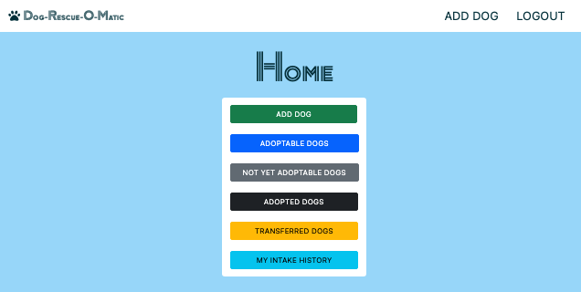
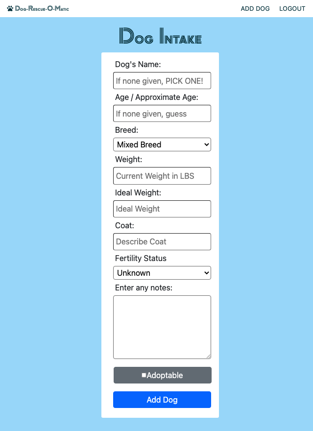
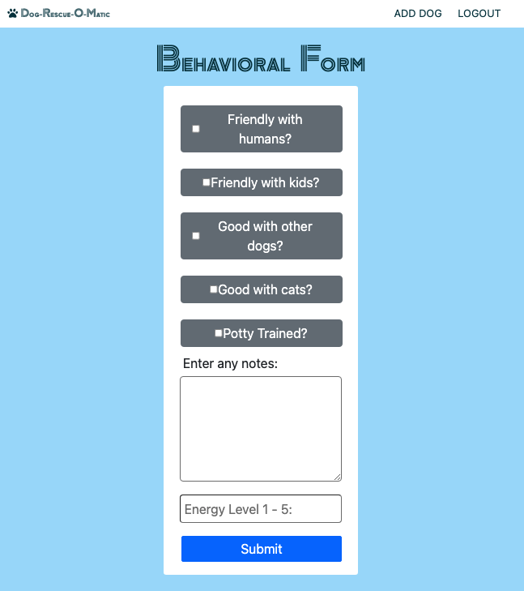
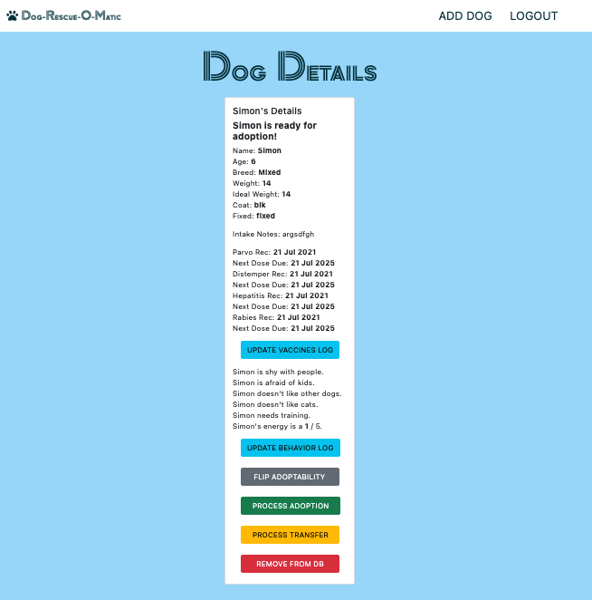
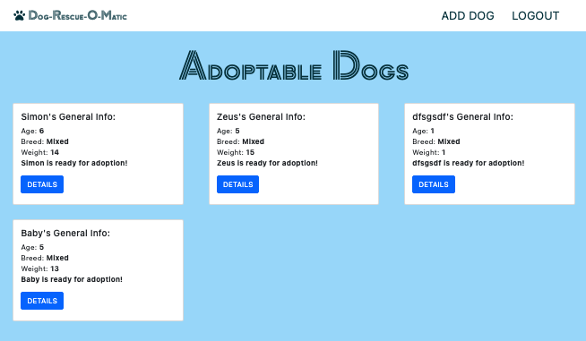
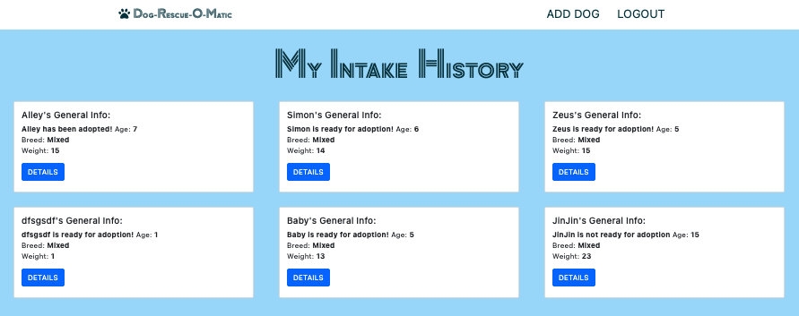
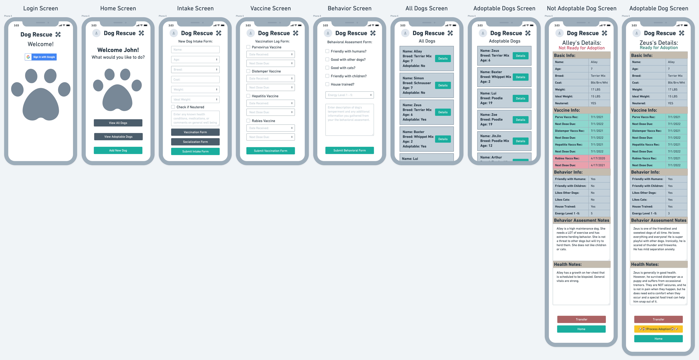
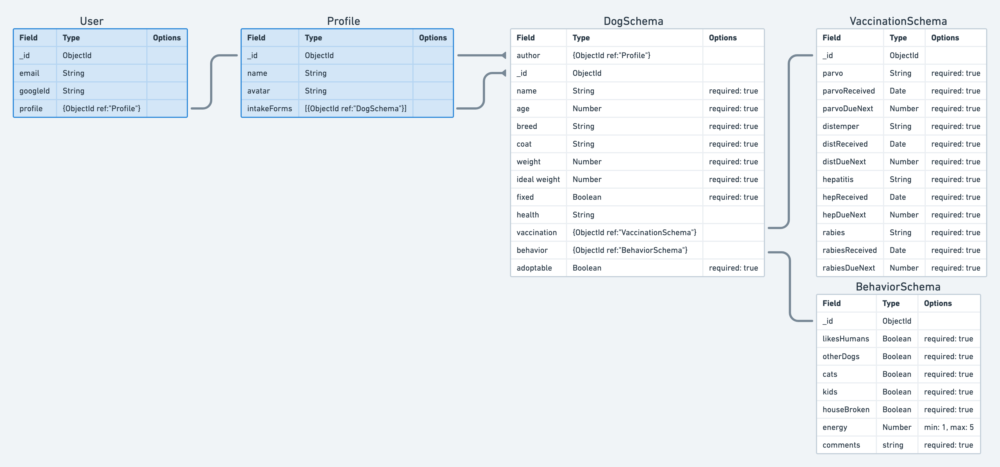

Dog-Rescue-O-Matic is a MEN stack application to aid dog rescues, maintain and update pertinent information for dogs within their rescue network. 

## About

Running a dog rescue can be ruff… There is a great deal of information to maintain for each dog in the system and monitoring changes to that information can be extremely important for ensuring a dog’s health and wellbeing and can increase their chances of finding a forever home! Most dog rescues in the U.S. are entirely volunteer based and do not have a centralized shelter or office. Maintaining all of this information in this type of operating environment often leads to unorganized and disjointed data spread across various text documents and spreadsheets. Dog-Rescue-O-Matic will keep you, your staff, and your volunteers from going barking mad, by keeping all of this data in the cloud and allowing access to view and edit this info from any smartphone or computer.

## Screenshots

## Getting Started

The app is deployed [HERE](https://dog-o-matic-rescue-app.herokuapp.com/dogs)

## Languages

* HTML * CSS * JavaScript

## Built With

* [MongoDB](https://www.mongodb.com/)
* [Mongoose](https://mongoosejs.com/)
* [Express](https://expressjs.com/)
* [Node.js](https://nodejs.org/)
* [Bootstrap](https://getbootstrap.com/)
* [Font Awesome](https://fontawesome.com/)

## Authors

**John Nelson-Alden** 

## Next Steps

* Light/Dark mode toggle to reduce eye strain and improve screen readability in light or dark environments.
* Enable authorized users to upload a profile pic of each dog in the system.
* Improved conditional rendering. Example: If vaccine due date is past current date the background color for the vaccine data will turn red.
* Improve navigation UX.
* Enable the app to send notifications to staff when vaccines are past due.

## Wireframe

## ERD

## Pseudocode and User Stories

Authenticated users of Dog-Rescue-O-Matic will be able to easily add incoming dogs to the rescue’s database via the Dog Intake page.

The rescue’s participating veterinary team will be able to easily log all vaccinations dates and due dates and record all health notes.

Dog socialization volunteers will be able to easily enter all appropriate behavioral information via the behavioral form and record any behavioral notes that will help successfully place dog’s in ideal forever homes.

Staff and volunteers will be able to process dogs for adoption by filling out a simple form. The dog’s records will automatically be updated from adoptable status to adopted and all the adoptor’s relevant information will be saved in the adopted dog’s records.

Staff and volunteers will be able to process dogs for transfer to a specialty rescue when necessary. Example: If it is discovered during a dog’s health assessment that they are terminally ill, they can be transferred to a specialized rescue program for terminally ill dogs.

Authenticated users can also easily remove dogs entirely from the database when appropriate. If a dog is errantly entered twice all the input data is incorrect the entry be removed. This feature may also be necessary if a dog unfortunately passes away before finding a forever home. Thus they are not ‘adoptable’, ‘adopted’ or ‘transferred’ and permanently storing data would not be useful.

